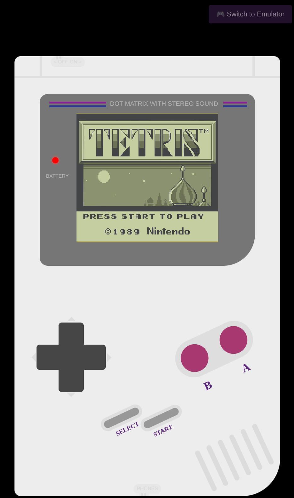

# 🎮 RetroBoy Tetris & Emulator

**Remember the good old days?** Now you can relive them right in your browser! 

This project features both a custom-built Tetris game and a full RetroBoy emulator, all wrapped in an authentic Nintendo RetroBoy console interface that works on both desktop and mobile devices.



## ✨ Features

### Tetris Mode
- 🕹️ **Authentic RetroBoy UI** - Complete with D-pad, A/B buttons, and Start/Select controls
- 📱 **Mobile-Friendly** - Touch controls that work perfectly on phones and tablets
- 🎵 **Classic Tetris Music** - The iconic theme song that'll get stuck in your head
- 🎨 **Pixel-Perfect Graphics** - Just like you remember from 1989
- ⚡ **Progressive Speed** - Gets faster as you level up
- 🏆 **Score Tracking** - Compete with yourself for the highest score

### Emulator Mode
- 🎮 **Full RetroBoy Emulator** - Play any RetroBoy ROM
- 💾 **Save States** - Save and load your progress in browser
- 🎵 **Audio Support** - Full sound emulation
- 📁 **ROM Upload** - Load your own legal ROMs
- 🕹️ **Same Controls** - Identical touch and keyboard controls

## 🎮 How to Play

### Desktop Controls
- **Arrow Keys** - Move and rotate pieces
  - ⬅️ Left / ➡️ Right - Move piece
  - ⬇️ Down - Drop faster
  - ⬆️ Up - Rotate piece
- **Space** - Pause/Resume
- **Enter** - Start game

### Mobile Controls
- **Touch the D-pad** to move pieces
- **Tap the A button** to rotate
- **Tap START** to begin or pause

### Mode Switching
- Use the **🎮 Switch** button in the top-right corner to toggle between Tetris and Emulator modes

## 🚀 Play Now

**[Click here to play!](https://kliarist.github.io/)**

- **Tetris Mode**: Instant play, no setup required
- **Emulator Mode**: Upload your own RetroBoy ROMs

## 🛠️ Tech Stack

- Pure JavaScript (no frameworks!)
- p5.js for graphics rendering
- p5.sound for audio playback
- CSS3 for the RetroBoy console design
- RetroBoy emulator core (GameBoyCore.js)

## 📁 Project Structure

```
retris/
├── index.html          # Tetris game (main page)
├── emulator.html       # RetroBoy emulator
├── js/
│   ├── game/          # Tetris game files
│   ├── emulator/      # Emulator core files
│   └── p5.sound.min.js
├── css/
│   ├── gameboy.css    # RetroBoy console styling
│   ├── common.css     # Shared styles
│   └── emulator.css   # Emulator-specific styles
├── assets/            # Images, audio, fonts
└── roms/              # Sample RetroBoy ROMs

```

## 🎯 Game Rules

Classic Tetris rules apply:
1. Complete horizontal lines to clear them and score points
2. Game ends when blocks stack to the top
3. Speed increases with each level
4. Press START after game over to play again

## 📝 Credits

Inspired by the original RetroBoy Tetris (1989) and built with love for retro gaming enthusiasts.

---

*Made with 💜 for nostalgic gamers everywhere*

